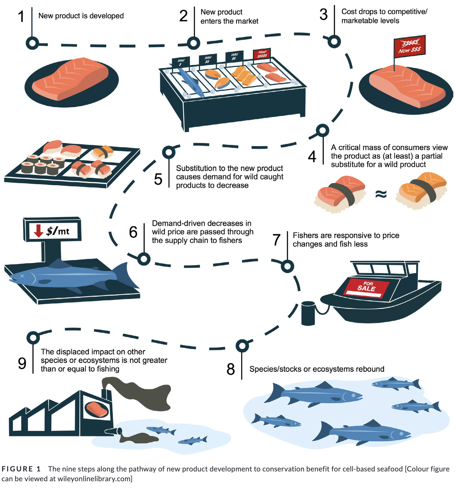

```{r setup, include=FALSE}
knitr::opts_chunk$set(collapse = TRUE)
```

### About the Paper 

In a new paper just published in PLoS ONE, myself and coauthors Benjamin Halpern, Jason Maier, Heather Lahr, Gordon Blasco, Christopher Costello, Richard Cottrell, Olivier Deschenes, Danielle Ferraro, Halley Froehlich, Gavin McDonald, and Michael Weir explore the conditions under which cell-based seafood might yield conservation benefits by displacing wild-caught seafood. Our paper entitled ["The long and narrow path for novel cell-based seafood to reduce fishing pressure for marine ecosystem recovery"](https://doi.org/10.1111/faf.12541) outlines the technological, behavioural, market and ecological changes that must occur in order for cell-based seafood to yield a conservation benefit, and conclude that fisheries recoveries and collateral ocean benefits are unlikely to result from this new technology.


