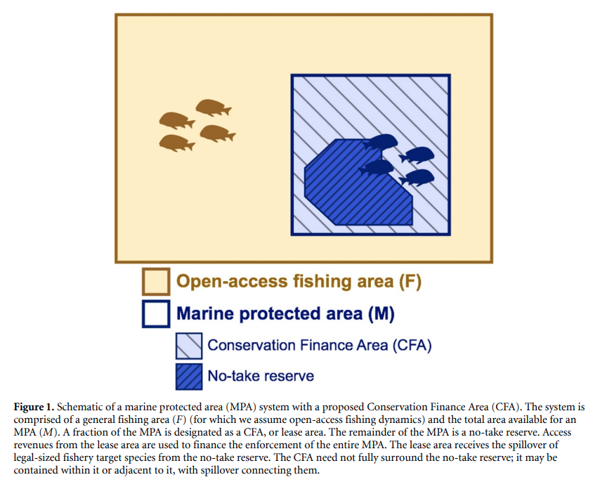
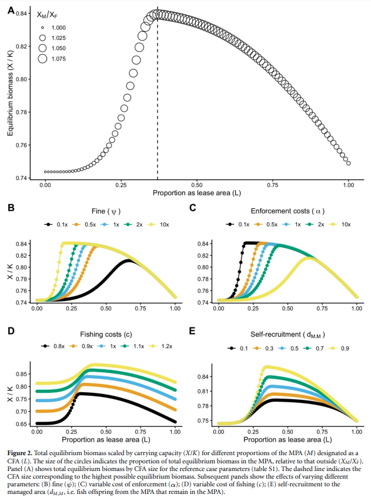

```{r setup, include=FALSE}
knitr::opts_chunk$set(collapse = TRUE)
```

### About the Paper 

In a new paper just published in Environmental Research Letters, myself and coauthors Juan Carlos Villaseñor-Derbez, Darcy Bradley, Matthew Burgess, Hunter Lenihan, and Christopher Costello propose a new institution to finance enforcement of marine protected areas. Our paper entitled ["Self-financed marine protected areas"](https://iopscience.iop.org/article/10.1088/1748-9326/ac3439) shows how this new institution---a 'conservation finance area' (CFA)---can help to remedy poaching in a MPA by allowing limited fishing leases and using the lease money to finance enforcement of the MPA. 



### Key Findings

Using a bioeconomic model we show that CFAs can fully finance MPA enforcement, deter illegal fishing, and ultimately maximize fish biomass. Moreover, we show that unless a large, exogenous, and perpetual enforcement budget is available, implementing a CFA in a no-take MPA always results in high biomass than without. </br> 

<p style="text-align: center;">

</p>

We conclude by exploring the real-world enabling conditions that would support such an institution, and highlight some real-world systems that share many features with CFAs to suggest that our proposed institution is a viable policy solution. 

### Media 

The following articles provide coverage of our paper:

- November 30, 2021 - Science: [A provacative proposal: sell fishing rights in protected areas to prevent poaching](https://www.science.org/content/article/provocative-proposal-sell-fishing-rights-protected-seas-prevent-poaching)
- December 22, 2021 - Hakai Magazine: [How Marine Protected Areas Can Pay for Their Own Protection](https://hakaimagazine.com/news/how-mpas-can-pay-for-their-own-protection/)