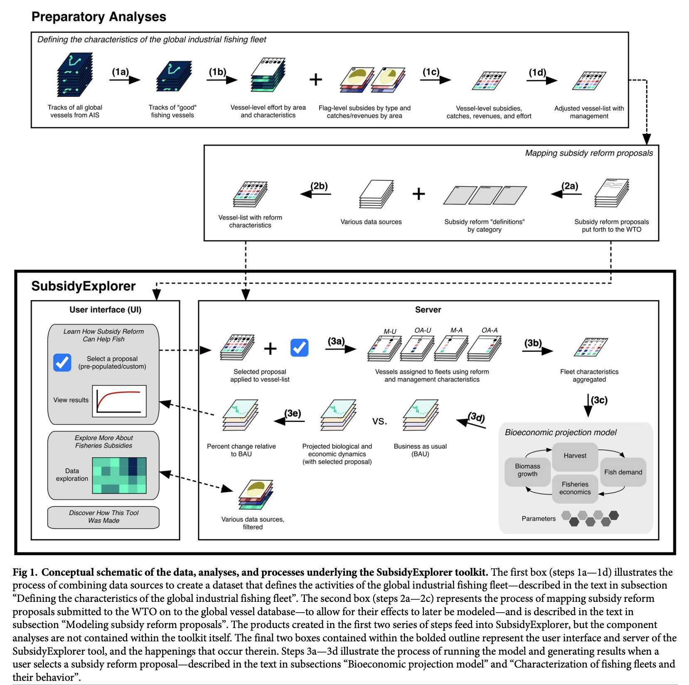

```{r setup, include=FALSE}
knitr::opts_chunk$set(collapse = TRUE)
```

### About the Paper 

In a new paper just published in PLoS ONE, myself and coauthors Vienna Saccomanno, Matthew Warham, Laura Lea Rubino, Anna Schuhbauer, U. Rashid Sumaila, and Christopher Costello present the decision support tool we created to help inform negotiations at the World Trade Organization about reforming fisheries subsidies. Our paper entitled ["SubsidyExplorer: A decision-support tool to improve our understanding of the ecological and economic effects of reforming fisheries subsidies"](https://doi.org/10.1371/journal.pone.0265829) explains how the SubsidyExplorer tool was built, describes the methodology behind the model contained within it, and presents the key results. 


