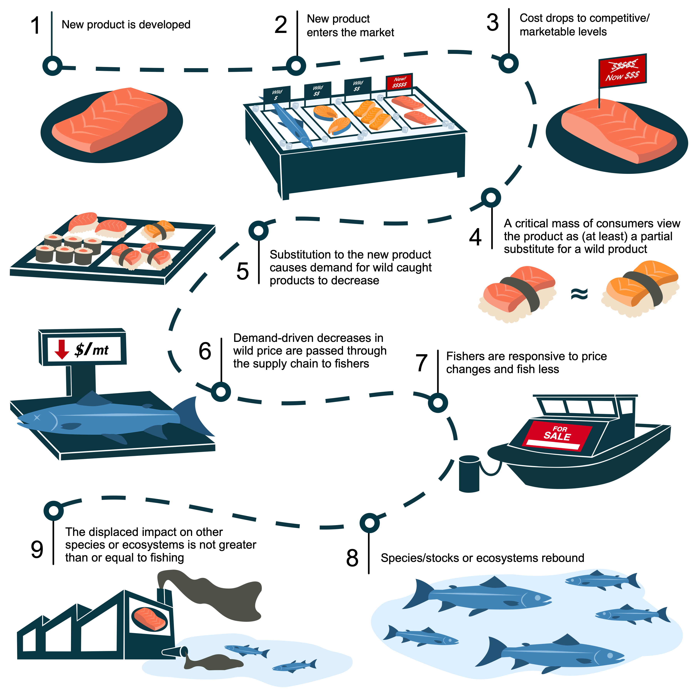
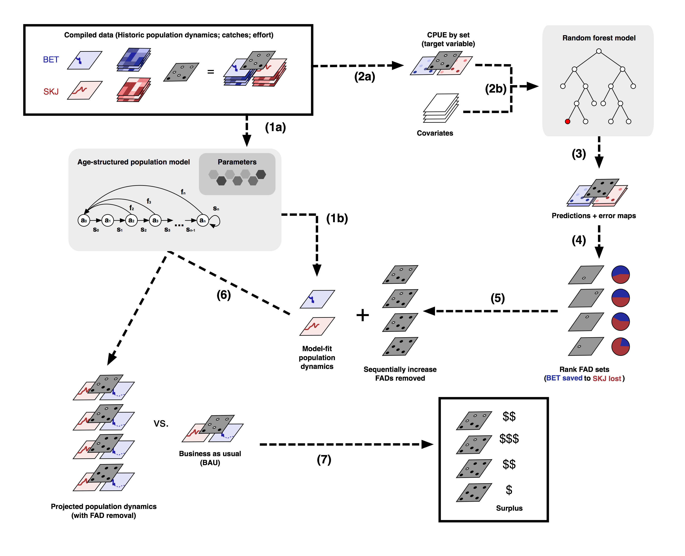
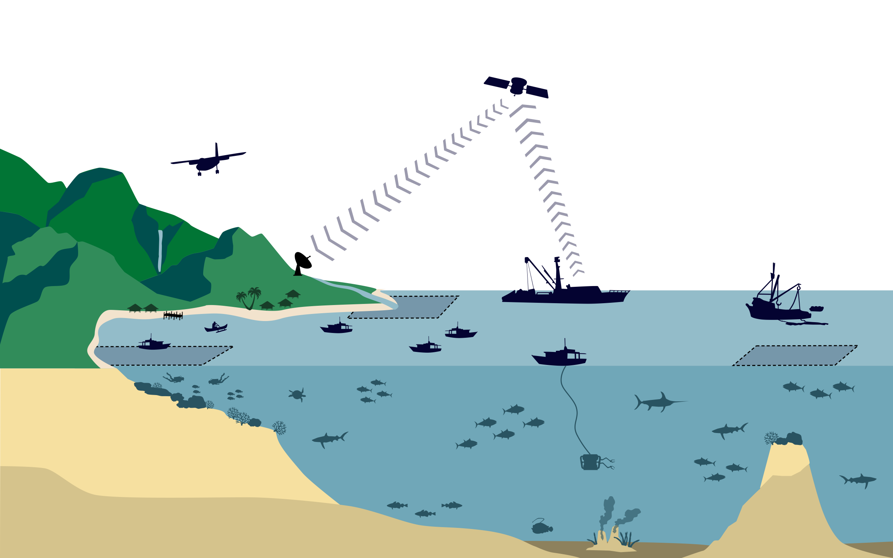

Much of my professional work is geared towards fishery managers and other stakeholders, and I regularly create products to make the the findings of my work more accessible to non-academic audiences. I am highly skilled in the use of many Adobe Creative Cloud products (e.g., Lightroom, Illustrator, In Design) to make illustrative graphics and technical reports, and I have developed a number of interactive web-based applications using *Shiny* to share the findings of research and to serve as decision-support tools for managers. I regularly write custom CSS and JavaScript for the apps I develop. 

### Shiny Apps

I was the lead developer for the following interactive web-based applications built using *Shiny*: 

| Title | URL | Year |
| - | - | - |
| SubsidyExplorer: A decision-support tool to improve our understanding of the ecological and economic effects of reforming fisheries subsidies | http://www.subsidyexplorer.org/ | 2021 |
| The Distant Water Fishing Atlas | http://www.dwfsubsidyatlas.org/ | 2021 |
| NutriCast: A web-based tool to explore forecasted nutritional gains from marine fisheries and mariculture reforms under climate change | https://emlab-ucsb.shinyapps.io/nutricast/ | 2020 |
| ACP Atlas of Distant Water Fishing | https://emlab-ucsb.shinyapps.io/SubsidyAtlasACP/ | 2019 |
| Cost and Performance Drivers of Electronic Fisheries Monitoring: An interactive toolkit to explore cost and performance tradeoffs of implementing electronic monitoring in fisheries | https://emlab-ucsb.shinyapps.io/EM-toolkit/ | 2018 |

I have also developed and contributed to a number of other *Shiny* apps that are not included here because they were built for clients under contract. Please [contact me directly by email](mailto:millagek@gmail.com) if you would like to know more about my experience with *Shiny* app development.

### Graphics

Many of the infographics, conceptual diagrams, and other graphics I make are intended to serve as figures or visual abstracts for scientific papers and are highlighted in my blog whenever the corresponding paper is published. The following are a few examples of the types of graphics I have created (click on the image to open a larger version):

<table>
  <tr>
    <td></td>
    <td></td>
  </tr>
  <tr>
    <td></td>
    <td></td>
  </tr>
</table>
